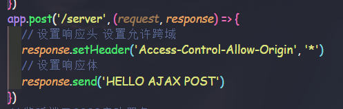
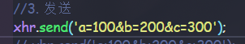
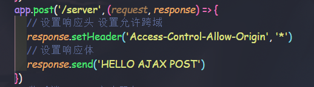
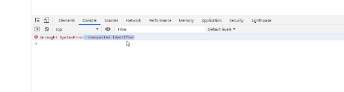
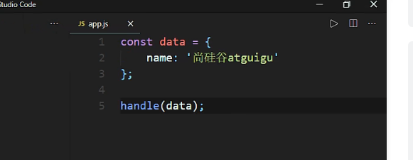
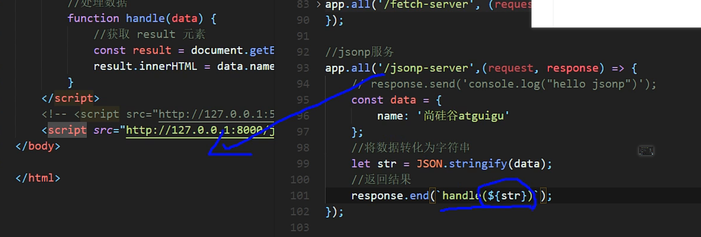
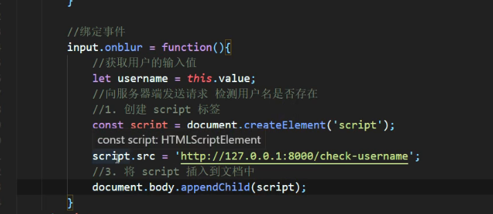
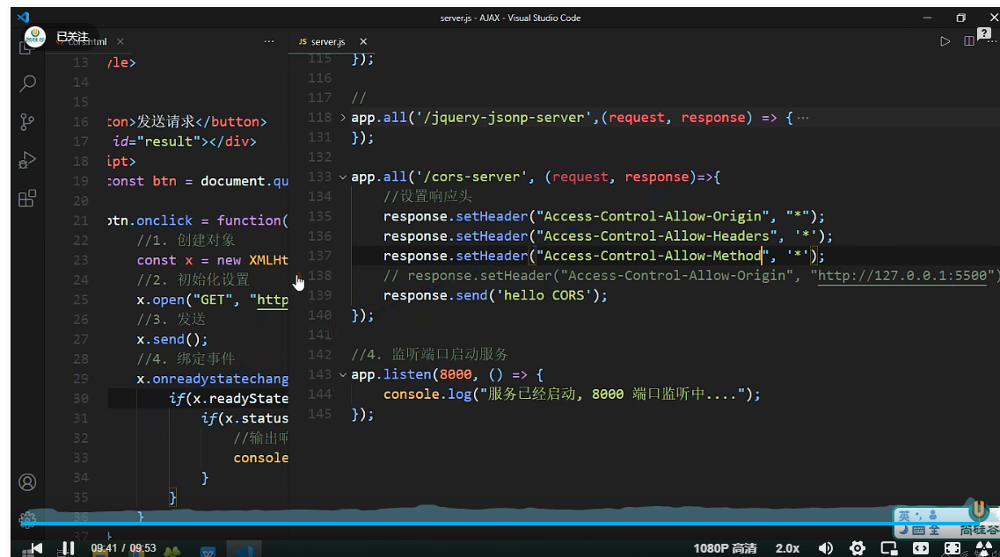

# AJAX（视频来自尚硅谷2020版本）

## AJAX简单介绍
**AJAX简介**  
1. AJAX 全称为 Asynchronous JavaScript And XML，就是异步的 JS 和 XML。
2. 可以像服务器发起异步请求
3. *可以无刷新页面获取数据*  

**XML简介**  
1. 可扩展语言，无预定标签，自定义标签
2. 传输和存储数据

**JSON**：传输和存储数据，现在的主流，代替XML

**使用场景**：  
浏览器种数据加载的大部分地方
1. 搜索引擎搜索框
2. 登录注册账号信息是否已存在
3. 板块加载
4. 加载拉长页面

## AJAX的优缺点
**优点**  
无刷页面与服务器交流  ；  
事件中允许更新内容  ；  
**缺点**  
没有浏览历史，不能回退页面    ；  
存在跨域问题（从一个服务器到另一个服务器）  ；  
SOE优化不友好（拿到数据利用JS动态创建元素，源代码是没有页面信息的，不能搜索引擎优化）；  

## HTTP协议
**是什么**：是浏览器与服务器之间通信的规则
 ### 请求报文
 | 行   | 头             | 空行 | 体                            |
 | ---- | -------------- | ---- | ----------------------------- |
 | 方法 | Host：         |      | username=admin&password=admin |
 | url  | Cookie：       |      |
 | 版本 | Content-type： |      |
 |      | User-Agent：   |      |
 |      |                |      |
 ### 响应报文
| 行                      | 头                 | 空行 | 体   |
| ----------------------- | ------------------ | ---- | ---- |
| 版本                    | Content-Type：     |      | html |
| 状态码：200 404 403 401 | Content-length     |      |
| 状态信息                | Content-encoding： |      |
|                         |                    |      |

## express框架的简单使用
```
// 引入express模块
const express = require('express')
// 创建express对象
const app = express()
// 创建路由规则
app.get('/', (request, response) => {
    // 设置响应体
    response.send('HELLO EXPRESS')
})
// 监听端口8000启动服务
app.listen(8000, () => {
    console.log('服务已经启动，8000端口监听中...')
})
```

## AJAX请求的基本操作
**绑定事件**
`btn.onclick = function(){}`
**创建对象**
`const xhr=new XMLHttpRequest();`
**初始化，设置请求方法和url**
`xhr.open('GET','http://127.0.0.1:8000/server');`
**发送**
`xhr.send();`
**事件绑定，处理服务端返回的结果**
```
// on  when 当....时候
            // readystate 是 xhr 对象中的属性, 表示状态 0 1 2 3 4
            // change  改变
            xhr.onreadystatechange = function(){
                //判断 (服务端返回了所有的结果)
                if(xhr.readyState === 4){
                    //判断响应状态码 200  404  403 401 500
                    // 2xx 成功
                    if(xhr.status >= 200 && xhr.status < 300){
                        //处理结果  行 头 空行 体
                        //响应 
                        // console.log(xhr.status);//状态码
                        // console.log(xhr.statusText);//状态字符串
                        // console.log(xhr.getAllResponseHeaders());//所有响应头
                        // console.log(xhr.response);//响应体
                        //设置 result 的文本
                        result.innerHTML = xhr.response;
                    }else{

                    }
                }
            }
```
**请求设置参数**
`xhr.open('GET', 'http://127.0.0.1:8000/server?a=100&b=200&c=300');`
**发送POST请求**
```
//2. 初始化 设置类型与 URL(只需更改这里)
 xhr.open('POST', 'http://127.0.0.1:8000/server');
```

还需要在express模块js文件中加入设置post方法的响应
**POST设置参数**

在express模块js文件中的send发送代码进行传参
`xhr.send(传参内容);`
**AJAX设置请求头信息**
```
<!-- 第一个是设置请求体内容类型。  第二个是设置发送查询字符类型，是一个固定写法 -->
xhr.setRequestHeader('Content-Type','application/x-www-form-urlencoded');
xhr.setRequestHeader('name','atguigu');
```
如果设置请求体内容是自定义的，不是预定义的，会触发安全机制，需要进行设置

*表示所有的头信息我都可以接受  
但是同时会触发option请求。来检验头信息可用不可用
因此还要设置app.post...为app.all...


## 服务端响应JSON数据
```
app.all('/json-server', (request, response) => {
    //设置响应头  设置允许跨域
    response.setHeader('Access-Control-Allow-Origin', '*');
    //响应头
    response.setHeader('Access-Control-Allow-Headers', '*');
    //响应一个数据
    const data = {
        name: 'atguigu'
    };
    //对对象进行字符串转换
    let str = JSON.stringify(data);
    //设置响应体
    response.send(str);
});

```

```
xhr.onreadystatechange = function(){
                if(xhr.readyState === 4){
                    if(xhr.status >= 200 && xhr.status < 300){
                        //
                        // console.log(xhr.response);
                        // result.innerHTML = xhr.response;
                        // 1. 手动对数据转化
                        // let data = JSON.parse(xhr.response);
                        // console.log(data);
                        // result.innerHTML = data.name;
                        // 2. 自动转换
                        console.log(xhr.response);
                        result.innerHTML = xhr.response.name;
                    }
                }
            }
```

## IE缓存问题解决
**为什么**：IE浏览器拿到服务器数据会保存到本地缓存，后面服务器数据更新的话，IE只会从本地缓存拿到数据，因此我们可以通过设置动态地址，拿到不同的数据。
**代码只需要改**
```
//初始化
xhr.open('GET','http://127.0.0.1:8000/ie?t='+Date.now());
```


## AJAX请求超时与网络异常
**创建xmlhttprequest对象xhr后**
`xhr.timeout=time(ms)`设置超时时间
`xhr.ontimeout=function()`绑定超时回调事件
`xhr.onerrror=function()`绑定网络异常回调事件

## AJAX取消请求
```
<!-- xmlhttprequest对象实例.abort() -->
x.abort();
```

## AJAX请求重复发送问题
**利用一个标识变量判断，进行取消请求**

## jQuery发送请求
```
 <script>
        $('button').eq(0).click(function(){
            $.get('http://127.0.0.1:8000/jquery-server', {a:100, b:200}, function(data){
                console.log(data);
            },'json');
        });

        $('button').eq(1).click(function(){
            $.post('http://127.0.0.1:8000/jquery-server', {a:100, b:200}, function(data){
                console.log(data);
            });
        });
    </script>
```

```
//jQuery 服务
app.all('/jquery-server', (request, response) => {
    //设置响应头  设置允许跨域
    response.setHeader('Access-Control-Allow-Origin', '*');
    response.setHeader('Access-Control-Allow-Headers', '*');
    // response.send('Hello jQuery AJAX');
    const data = {name:'尚硅谷'};
    response.send(JSON.stringify(data));
});
```

## jQuery通用方法发送AJAX请求
```
$('button').eq(2).click(function(){
            $.ajax({
                //url
                url: 'http://127.0.0.1:8000/jquery-server',
                //参数
                data: {a:100, b:200},
                //请求类型
                type: 'GET',
                //响应体结果
                dataType: 'json',
                //成功的回调
                success: function(data){
                    console.log(data);
                },
                //超时时间
                timeout: 2000,
                //失败的回调
                error: function(){
                    console.log('出错啦!!');
                },
                //头信息
                headers: {
                    c:300,
                    d:400
                }
            });
        });
```

## Axios发送AJAX请求
```
    <script>
        // https://github.com/axios/axios
        const btns = document.querySelectorAll('button');

        //配置 baseURL
        axios.defaults.baseURL = 'http://127.0.0.1:8000';

        btns[0].onclick = function () {
            //GET 请求
            axios.get('/axios-server', {
                //url 参数
                params: {
                    id: 100,
                    vip: 7
                },
                //请求头信息
                headers: {
                    name: 'atguigu',
                    age: 20
                }
            }).then(value => {
                console.log(value);
            });
        }

        btns[1].onclick = function () {
            axios.post('/axios-server', {
                username: 'admin',
                password: 'admin'
            }, {
                //url 
                params: {
                    id: 200,
                    vip: 9
                },
                //请求头参数
                headers: {
                    height: 180,
                    weight: 180,
                }
            });
        }
    
        btns[2].onclick = function(){
            axios({
                //请求方法
                method : 'POST',
                //url
                url: '/axios-server',
                //url参数
                params: {
                    vip:10,
                    level:30
                },
                //头信息
                headers: {
                    a:100,
                    b:200
                },
                //请求体参数
                data: {
                    username: 'admin',
                    password: 'admin'
                }
            }).then(response=>{
                //响应状态码
                console.log(response.status);
                //响应状态字符串
                console.log(response.statusText);
                //响应头信息
                console.log(response.headers);
                //响应体
                console.log(response.data);
            })
        }
    </script>
```

## fetch函数发送请求
```
 <script>
        //文档地址
        //https://developer.mozilla.org/zh-CN/docs/Web/API/WindowOrWorkerGlobalScope/fetch
        
        const btn = document.querySelector('button');

        btn.onclick = function(){
            fetch('http://127.0.0.1:8000/fetch-server?vip=10', {
                //请求方法
                method: 'POST',
                //请求头
                headers: {
                    name:'atguigu'
                },
                //请求体
                body: 'username=admin&password=admin'
            }).then(response => {
                // return response.text();
                return response.json();
            }).then(response=>{
                console.log(response);
            });
        }
    </script>
```


## 同源策略
**AJAX满足同源策略，即是来源于同一个服务器**    
满足同源策略可以简写url

**跨域是因为单个服务器性能有限，与多个服务器合作能提高性能**  
*JSONP是一个非官方跨域解决方案，可惜只支持get请求。*  
html文件用live serve插件后，script文件引入是用http引入的，因此可以实现跨域。  
相当于代码二合一。
**注意**：返回结果要符合js规范，不然解析不了，会出现如下错误。


app.js在服务端返回的实现



## 原生jsonp实践


## jQuery发送jsonp请求
```
 <script>
        $('button').eq(0).click(function(){
            $.get('http://127.0.0.1:8000/jquery-server', {a:100, b:200}, function(data){
                console.log(data);
            },'json');
        });

        $('button').eq(1).click(function(){
            $.post('http://127.0.0.1:8000/jquery-server', {a:100, b:200}, function(data){
                console.log(data);
            });
        });

        $('button').eq(2).click(function(){
            $.ajax({
                //url
                url: 'http://127.0.0.1:8000/jquery-server',
                //参数
                data: {a:100, b:200},
                //请求类型
                type: 'GET',
                //响应体结果
                dataType: 'json',
                //成功的回调
                success: function(data){
                    console.log(data);
                },
                //超时时间
                timeout: 2000,
                //失败的回调
                error: function(){
                    console.log('出错啦!!');
                },
                //头信息
                headers: {
                    c:300,
                    d:400
                }
            });
        });

    </script>
```

```
//
app.all('/jquery-jsonp-server',(request, response) => {
    // response.send('console.log("hello jsonp")');
    const data = {
        name:'尚硅谷',
        city: ['北京','上海','深圳']
    };
    //将数据转化为字符串
    let str = JSON.stringify(data);
    //接收 callback 参数
    let cb = request.query.callback;

    //返回结果，response.end()方法用于结束响应并发送最终的响应数据。
    response.end(`${cb}(${str})`);
});
```

## CORS实现跨域
**CORS（Cross-Origin Resource Sharing），跨域资源共享。CORS 是官方的跨域解决方案，它的特点是不需要在客户端做任何特殊的操作，完全在服务器中进行处理，支持get 和 post 请求。跨域资源共享标准新增了一组 HTTP 首部字段，允许服务器声明哪些源站通过浏览器有权限访问哪些资源。**

*需要设置响应头*

```
app.all('/cors-server', (request, response)=>{
    //设置响应头
    response.setHeader("Access-Control-Allow-Origin", "*");
    response.setHeader("Access-Control-Allow-Headers", '*');
    response.setHeader("Access-Control-Allow-Method", '*');
    // response.setHeader("Access-Control-Allow-Origin", "http://127.0.0.1:5500");
    response.send('hello CORS');
});
```
